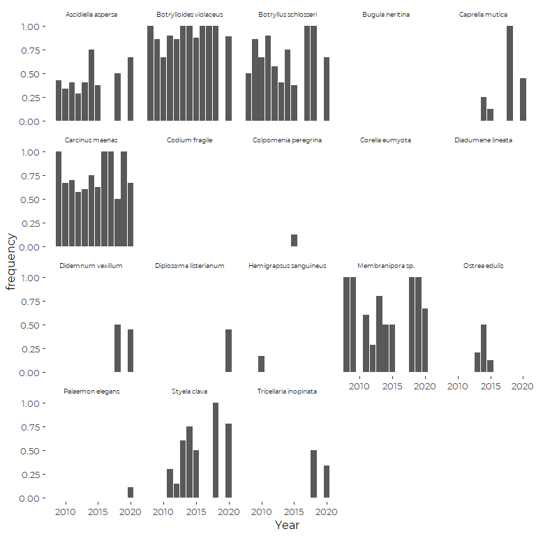
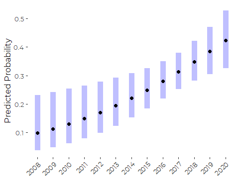
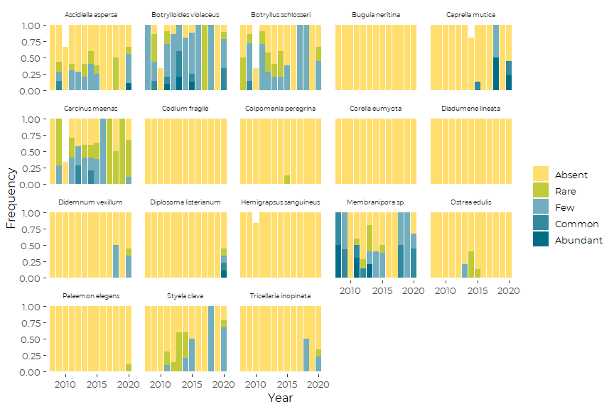

Examination of Trendsin MIMIC Invasive Species Data
================
Curtis C. Bohlen, Casco Bay Estuary Partnership
3/12/2021

-   [Introduction](#introduction)
-   [Load Libraries](#load-libraries)
-   [Load Data](#load-data)
    -   [Establish Folder Reference](#establish-folder-reference)
-   [Import Fully QA/QC’d Data](#import-fully-qaqcd-data)
-   [Convert to Factors for Display
    Order](#convert-to-factors-for-display-order)
-   [Add Order Factors](#add-order-factors)
-   [Analyzing Sampling Effort](#analyzing-sampling-effort)
-   [Trend Data](#trend-data)
-   [Analysis Pricipals](#analysis-pricipals)
-   [Presence / Absence](#presence--absence)
    -   [Trend Data](#trend-data-1)
        -   [Preliminary Graphic](#preliminary-graphic)
        -   [Binomial Models](#binomial-models)
-   [Abundance Data](#abundance-data)
-   [Multinomial Models](#multinomial-models)
-   [Example Proportional Odds Model](#example-proportional-odds-model)
    -   [Table of Results](#table-of-results-1)


# Introduction

This Notebook looks for long-term trends in abundance of invasive
species in the MIMIC invasive species monitoring program from Casco Bay.

The Marine Invader Monitoring and Information Collaborative (MIMIC) in
Casco Bay is a partnership between CBEP, the Wells National Estuarine
Research Reserve (Wells NERR), and the regional MIMIC program. The
Regional effort includes participants from several other New England
States.

Wells NERR trains community scientists to identify (currently) 23
species of invasives, including tunicates, bryozoans, algae and
crustaceans. Scientists visit sites monthly between May and October and
document abundance of these non-native species.

The program began with two sites in Casco Bay in 2008 and has expanded
in ensuing years to sample an additional mainland site and 12 sites
across four Islands (Peaks, Chebeague, Long, and Great Diamond). That
expansion obviously complicates trend analysis, and trends must consider
the number of site visits each year.

# Load Libraries

``` r
library(tidyverse)
#> -- Attaching packages --------------------------------------- tidyverse 1.3.1 --
#> v ggplot2 3.3.5     v purrr   0.3.4
#> v tibble  3.1.6     v dplyr   1.0.7
#> v tidyr   1.1.4     v stringr 1.4.0
#> v readr   2.1.0     v forcats 0.5.1
#> -- Conflicts ------------------------------------------ tidyverse_conflicts() --
#> x dplyr::filter() masks stats::filter()
#> x dplyr::lag()    masks stats::lag()
library(readxl)

library(VGAM)
#> Loading required package: stats4
#> Loading required package: splines
#> 
#> Attaching package: 'VGAM'
#> The following object is masked from 'package:tidyr':
#> 
#>     fill
library(emmeans)
#library(readr)

#library(GGally)
#library(zoo)
#library(lubridate)  # here, for the make_datetime() function

library(CBEPgraphics)
load_cbep_fonts()
theme_set(theme_cbep())
```

# Load Data

## Establish Folder Reference

``` r
sibfldnm <- 'Data'
parent   <- dirname(getwd())
sibling  <- file.path(parent,sibfldnm)
#dir.create(file.path(getwd(), 'figures'), showWarnings = FALSE)
```

# Import Fully QA/QC’d Data

``` r
fn <- 'Abundance_Data.csv'
abundance_data <- read_csv(file.path(sibling, fn),
                           col_types = cols(
                             Date = col_datetime(format = ""),
                             Site = col_character(),
                             Type = col_character(),
                             City = col_character(),
                             Salinity = col_double(),
                             Temp = col_double(),
                             Month = col_character(),
                             Year = col_integer(),
                             Where = col_character(),
                             Species = col_character(),
                             Common = col_character(),
                             Abundance = col_character()
                           )) %>%
  mutate(Type  = factor(Type, levels = c('Dock', 'Tidepool')),
         Month = factor(Month, levels = month.abb),
         Abundance = ordered(Abundance, levels = c('Absent', 'Rare', 'Few', 
                                                   'Common', 'Abundant')))

fn <- 'Presence_Data.csv'
presence_data <- read_csv(file.path(sibling, fn),
                          col_types = cols(
                             Date = col_datetime(format = ""),
                             Site = col_character(),
                             Type = col_character(),
                             City = col_character(),
                             Salinity = col_double(),
                             Temp = col_double(),
                             Month = col_character(),
                             Year = col_integer(),
                             Where = col_character(),
                             Species = col_character(),
                             Common = col_character(),
                             Present = col_logical()
                           )) %>%
  mutate(Type  = factor(Type, levels = c('Dock', 'Tidepool')),
         Month = factor(Month, levels = month.abb))
```

# Convert to Factors for Display Order

``` r
abundance_data <- abundance_data %>%
 mutate(Site = factor(Site, levels = 
                         c(  "Spring Point Marina",
                             "SMCC Dock", 
                             "Siegel's Reef",
                             
                             "Peaks Dock",
                             "Peaks Tidepool",
                             
                             "Great Diamond Island Dock", 
                             "Great Diamond Island Tidepool",
                             
                             "Long Island Dock",
                             "Fowler's Tide Pool",
                             
                             "Chandlers Wharf Dock",
                             #"Chebeague Island Boat Yard",
                             "Chebeague Stone Pier", 
                             "Waldo Point"
                         )),
         Where = factor(Where, levels = c("Mainland", "Peaks","Great Diamond",
                                          "Long", "Chebeague") ))
```

``` r
presence_data <- presence_data %>%
  mutate(Site = factor(Site, levels = 
                         c(  "Spring Point Marina",
                             "SMCC Dock", 
                             "Siegel's Reef",
                             
                             "Peaks Dock",
                             "Peaks Tidepool",
                             
                             "Great Diamond Island Dock", 
                             "Great Diamond Island Tidepool",
                             
                             "Long Island Dock",
                             "Fowler's Tide Pool",
                             
                             "Chandlers Wharf Dock",
                             "Chebeague Stone Pier", 
                             "Waldo Point"
                         )),
         Where = factor(Where, levels = c("Mainland", "Peaks","Great Diamond",
                                          "Long", "Chebeague") ))
```

# Add Order Factors

We need to organize graphics by island in consistent structure. We will
use a bar chart, organized by Island and a common sequence within island
groups. To facilitate that, we need a factor that orders sites
consistently within island groups. While we are at it, we create
alternate labels for the plots.

``` r
orders <- tribble (
  ~Site,                            ~Order,      ~Label,
  "Spring Point Marina",               1,         "Spring Point Marina",  
  "SMCC Dock",                         2,         "SMCC Dock",
  "Siegel's Reef",                     3,         "Siegel's Reef",  
  
  "Peaks Dock",                        1,          "Peaks Dock",          
  "Peaks Tidepool",                    2,          "Peaks Tidepool", 
  
  "Great Diamond Island Dock",         1,          "Great Diamond Dock",    
  "Great Diamond Island Tidepool",     2,          "Great Diamond Tidepool",
  
  "Long Island Dock",                  1,          "Long Island Dock",  
  "Fowler's Tide Pool",                2,          "Fowler's Tidepool",   
  
  "Chandlers Wharf Dock",              1,          "Chandlers Wharf Dock",  
  "Chebeague Stone Pier",              2,          "Stone Pier",   
  "Waldo Point" ,                      3,          "Waldo Point")
```

``` r
abundance_data <- abundance_data %>%
  left_join(orders, by = 'Site')

presence_data <- presence_data %>%
  left_join(orders, by = 'Site')
```

# Analyzing Sampling Effort

Lets look at distribution of EFFORT by sites and years.

``` r
site_visits <- presence_data %>%
  group_by(Site, Year, Month) %>%
  summarize(Sampled = n() > 0,
            .groups = 'drop')   # This includes NA values, which are still
                                # evidence of a site visit.

site_visits %>%
  group_by(Site, Year) %>%
  summarize(Visits = sum(Sampled)) %>%
  pivot_wider(names_from = Year, values_from = Visits) %>%
  select("Site", sort(colnames(.)))
#> `summarise()` has grouped output by 'Site'. You can override using the `.groups` argument.
#> # A tibble: 12 x 14
#> # Groups:   Site [12]
#>    Site    `2008` `2009` `2010` `2011` `2012` `2013` `2014` `2015` `2016` `2017`
#>    <chr>    <int>  <int>  <int>  <int>  <int>  <int>  <int>  <int>  <int>  <int>
#>  1 Chandl~     NA     NA     NA     NA     NA     NA     NA     NA     NA     NA
#>  2 Chebea~     NA     NA     NA     NA     NA     NA      5      3      2      4
#>  3 Fowler~     NA     NA     NA     NA     NA     NA     NA     NA      2      3
#>  4 Great ~     NA     NA     NA     NA     NA     NA     NA     NA     NA     NA
#>  5 Great ~     NA     NA     NA     NA     NA     NA     NA     NA     NA     NA
#>  6 Long I~     NA     NA     NA     NA     NA     NA     NA      1      1     NA
#>  7 Peaks ~     NA     NA     NA     NA     NA     NA      4      4      3      1
#>  8 Peaks ~     NA     NA     NA     NA     NA     NA      1      2      4      2
#>  9 Siegel~     NA      3      3      5      4      3      2      3      1      1
#> 10 SMCC D~      2      4      3      5      3      2      2      4     NA     NA
#> 11 Spring~     NA     NA     NA     NA     NA     NA     NA     NA     NA      3
#> 12 Waldo ~     NA     NA     NA     NA     NA     NA     NA     NA     NA     NA
#> # ... with 3 more variables: 2018 <int>, 2019 <int>, 2020 <int>
```

So…

1.  Only the South Portland sites (Siegel’s Reef and SMCC Dock) have a
    long enough record for robust trend analysis. Peaks Dock and
    Chebeague Stone Pier have six years of record.

2.  Several Sites have almost never been sampled, and should probably be
    dropped from any site by site analysis, but could be included in
    Bay-wide species occurrences.

# Trend Data

For trend sites, we need sites with data from at least five of the last
ten years, and at least two years prior to the most recent five years.

``` r
trend_sites <- site_visits %>%
  group_by (Site, Year) %>%
  summarize(Sampled = any(Sampled > 0, na.rm = TRUE),
            .groups = 'drop') %>%
  group_by(Site) %>%
  summarize(Years = sum(Sampled),
            Recent = sum(Sampled & Year > 2015),
            .groups = 'keep') %>%
  filter(Years >= 10, Recent >= 3) %>%
  pull(Site)
  
trend_presence_data <- presence_data %>%
  filter (Site %in% trend_sites)
trend_abundance_data <- abundance_data %>%
  filter (Site %in% trend_sites)
```

That tightly restricts our analysis, so may not be optimal. The problem
is how do we address site-by-site differences in a more complex model
where some sites have been tracked for only a few years. We probably
need to develop parallel analyses, using both data from the two sites
tracked long enough to examine trends and all data from all sites.

# Analysis Pricipals

We have to be a bit careful here about interpreting these data, because
of varying annual effort. We need to make sure we are scaling analyses
by effort. We will consider a unit of effort to be the combination of a
site and a month of sampling.

We also need to consider different patterns of “common”.  
\* Species found at high abundances  
\* Species found in most years  
\* Species found at most sites.

Some species appear more abundant in recent years, but that may reflect
different distributions of effort among years and sites.

This suggests a couple of binomial models. but binomial models are going
to be structurally unstable, since many species are rare enough that we
will have structural zeros, and thus a significant Hauke-Donner effect.

# Presence / Absence

## Trend Data

### Preliminary Graphic

``` r
visits <- trend_presence_data %>%
  group_by(Year, Site) %>%
  summarize(site_visits = length(unique(Date)),
            .groups = 'drop_last') %>%
  summarize(site_visits = sum(site_visits),
            .groups = 'drop')

tmp <- trend_presence_data %>%
  select(-Common, -City, -Salinity, -Temp) %>%
  group_by(Year, Site, Species) %>%
  summarize(observations = sum(Present, na.rm = TRUE),
            .groups = 'keep') %>%
  filter (! is.na(Species)) %>%
  left_join(visits, by = 'Year') %>%
  summarize(site_visits = first (site_visits),
            frequency = observations / site_visits, 
            .groups = 'drop')
tmp
#> # A tibble: 378 x 5
#>     Year Site      Species                site_visits frequency
#>    <int> <chr>     <chr>                        <int>     <dbl>
#>  1  2008 SMCC Dock Ascidiella aspersa               2       0  
#>  2  2008 SMCC Dock Botrylloides violaceus           2       1  
#>  3  2008 SMCC Dock Botryllus schlosseri             2       0.5
#>  4  2008 SMCC Dock Bugula neritina                  2       0  
#>  5  2008 SMCC Dock Caprella mutica                  2       0  
#>  6  2008 SMCC Dock Carcinus maenas                  2       0  
#>  7  2008 SMCC Dock Codium fragile                   2       0  
#>  8  2008 SMCC Dock Colpomenia peregrina             2       0  
#>  9  2008 SMCC Dock Corella eumyota                  2       0  
#> 10  2008 SMCC Dock Diadumene lineata                2       0  
#> # ... with 368 more rows
```

``` r
ggplot(tmp, aes(Year, frequency)) +
  geom_col(aes(Clor = )) +
  facet_wrap(~Species) +

  scale_x_continuous(breaks = c(2010, 2015, 2020)) +
  
  theme_cbep(base_size = 12) +
  theme(strip.text = element_text(size = 7))
```



That reveals what look like increases in abundance for six species at
these two long-term sites: *Caprella mutica*, *Didemnum vexillum*,
*Diplosoma listerianum*, *Palaemon elegans*, *Styela clava*, and
*Tricellaria inopinata*.

A few of the other sites may also provide significant changes in
abundance, but it looks unlikely.

We are aware that the Palaemon was not searched for in the first few
years of the program, but it was not found anywhere in New England until
a few years ago, so that is unlikely to be a problem. A few other
species were also added to the program over the period of record, as
they because mroe abundant in New England.

### Binomial Models

We fit a binomial model for each species independently.

#### Example Binomial Models

``` r
test_glm <- glm(Present ~ Year, family = binomial(), 
                data = presence_data, subset = Species == 'Styela clava')
summary(test_glm)
#> 
#> Call:
#> glm(formula = Present ~ Year, family = binomial(), data = presence_data, 
#>     subset = Species == "Styela clava")
#> 
#> Deviance Residuals: 
#>     Min       1Q   Median       3Q      Max  
#> -1.0123  -0.8962  -0.7386   1.3521   1.9617  
#> 
#> Coefficients:
#>               Estimate Std. Error z value Pr(>|z|)   
#> (Intercept) -306.67441  109.57703  -2.799  0.00513 **
#> Year           0.15162    0.05432   2.791  0.00525 **
#> ---
#> Signif. codes:  0 '***' 0.001 '**' 0.01 '*' 0.05 '.' 0.1 ' ' 1
#> 
#> (Dispersion parameter for binomial family taken to be 1)
#> 
#>     Null deviance: 255.54  on 210  degrees of freedom
#> Residual deviance: 246.68  on 209  degrees of freedom
#>   (211 observations deleted due to missingness)
#> AIC: 250.68
#> 
#> Number of Fisher Scoring iterations: 4
```

So that suggests the probability of Observing *Styela* has increased.

``` r
test_glm <- glm(Present ~ Year, family = binomial(), 
                data = presence_data, subset = Species == 'Caprella mutica')
as_tibble(summary(test_glm)$coefficients)
#> # A tibble: 2 x 4
#>   Estimate `Std. Error` `z value` `Pr(>|z|)`
#>      <dbl>        <dbl>     <dbl>      <dbl>
#> 1 -321.        109.         -2.95    0.00315
#> 2    0.159       0.0538      2.95    0.00322
```

That also suggests the probability of observing *Caprella* has
increased.

We can abuse the `emmeans()` function slightly to generate predicted
probabilities of observing *Caprella* on any given site visit at one of
these two sites.

``` r
emms <- emmeans(test_glm, 'Year', at = list(Year = 2008:2020), type = 'response')
plot(emms) +

  theme_cbep(base_size = 12) +
  theme(axis.text.x = element_text(angle = 45, hjust = 1)) +
  xlab('Predicted Probability') +
  ylab('') +
  coord_flip()
```



#### Construct Nested Tibble

``` r
nested_presence <- presence_data %>%
  filter(! is.na(Species)) %>%
  group_by(Species) %>%
  nest()
```

#### Add Model and Coefficients Estimate Information

``` r
nested_presence <- nested_presence %>%
  mutate(year_glm = map(data,
                        function(df) glm(Present ~ Year, family = binomial(), 
                                         data = df))) %>%
  mutate(glm_coef = map(year_glm,
                        function(mod) summary(mod)$coefficients),
        glm_p = glm_coef[[1]][2,4],
         glm_slope = glm_coef[[1]][2,1]) 
```

#### Examine Results

``` r
for (s in nested_presence$Species) {
  cat('\n\n')
  print(s)
  print(nested_presence$glm_coef[nested_presence$Species == s][[1]])
}
#> 
#> 
#> [1] "Botrylloides violaceus"
#>                 Estimate   Std. Error    z value  Pr(>|z|)
#> (Intercept) 100.80195107 114.44481788  0.8807909 0.3784310
#> Year         -0.04926367   0.05674453 -0.8681660 0.3853034
#> 
#> 
#> [1] "Botryllus schlosseri"
#>                Estimate  Std. Error   z value     Pr(>|z|)
#> (Intercept) 329.4155696 91.30223528  3.607968 0.0003086042
#> Year         -0.1635308  0.04527922 -3.611609 0.0003043034
#> 
#> 
#> [1] "Membranipora sp."
#>                 Estimate Std. Error    z value  Pr(>|z|)
#> (Intercept) -38.05261805 86.5508622 -0.4396561 0.6601862
#> Year          0.01906581  0.0429216  0.4442007 0.6568975
#> 
#> 
#> [1] "Carcinus maenas"
#>                 Estimate  Std. Error   z value  Pr(>|z|)
#> (Intercept) 136.60718367 86.31274977  1.582700 0.1134899
#> Year         -0.06780552  0.04280295 -1.584132 0.1131637
#> 
#> 
#> [1] "Ascidiella aspersa"
#>               Estimate  Std. Error    z value  Pr(>|z|)
#> (Intercept) 44.0110876 93.35264427  0.4714498 0.6373195
#> Year        -0.0222835  0.04629614 -0.4813251 0.6302854
#> 
#> 
#> [1] "Hemigrapsus sanguineus"
#>                  Estimate  Std. Error     z value  Pr(>|z|)
#> (Intercept) -19.195992515 283.1834956 -0.06778641 0.9459557
#> Year          0.007675227   0.1404262  0.05465667 0.9564120
#> 
#> 
#> [1] "Styela clava"
#>                 Estimate   Std. Error   z value    Pr(>|z|)
#> (Intercept) -306.6744138 109.57702661 -2.798711 0.005130706
#> Year           0.1516201   0.05432099  2.791189 0.005251482
#> 
#> 
#> [1] "Ostrea edulis"
#>                 Estimate   Std. Error   z value   Pr(>|z|)
#> (Intercept) -348.9701960 147.33652732 -2.368525 0.01785919
#> Year           0.1721886   0.07302543  2.357926 0.01837734
#> 
#> 
#> [1] "Bugula neritina"
#>                Estimate  Std. Error    z value  Pr(>|z|)
#> (Intercept) 91.09781357 294.8826453  0.3089290 0.7573755
#> Year        -0.04713862   0.1462701 -0.3222711 0.7472473
#> 
#> 
#> [1] "Caprella mutica"
#>                 Estimate   Std. Error   z value    Pr(>|z|)
#> (Intercept) -320.5853019 108.58492585 -2.952392 0.003153220
#> Year           0.1585512   0.05382927  2.945446 0.003224895
#> 
#> 
#> [1] "Diplosoma listerianum"
#>                  Estimate  Std. Error   z value    Pr(>|z|)
#> (Intercept) -1340.1981583 474.0009755 -2.827416 0.004692526
#> Year            0.6627645   0.2347556  2.823211 0.004754527
#> 
#> 
#> [1] "Didemnum vexillum"
#>                 Estimate   Std. Error   z value     Pr(>|z|)
#> (Intercept) -644.6603727 146.93150601 -4.387489 1.146668e-05
#> Year           0.3190914   0.07281432  4.382261 1.174539e-05
#> 
#> 
#> [1] "Colpomenia peregrina"
#>                 Estimate  Std. Error   z value   Pr(>|z|)
#> (Intercept) -943.5960367 423.9571276 -2.225687 0.02603513
#> Year           0.4661565   0.2099988  2.219806 0.02643193
#> 
#> 
#> [1] "Diadumene lineata"
#>                 Estimate  Std. Error   z value   Pr(>|z|)
#> (Intercept) -608.2113350 321.0797595 -1.894269 0.05818935
#> Year           0.3000134   0.1590762  1.885972 0.05929873
#> 
#> 
#> [1] "Codium fragile"
#>                 Estimate  Std. Error   z value   Pr(>|z|)
#> (Intercept) -661.7471371 336.6238138 -1.965836 0.04931758
#> Year           0.3265366   0.1667699  1.958006 0.05022926
#> 
#> 
#> [1] "Corella eumyota"
#>                  Estimate  Std. Error    z value  Pr(>|z|)
#> (Intercept) -103.56484319 668.6931039 -0.1548765 0.8769187
#> Year           0.04870062   0.3315285  0.1468972 0.8832131
#> 
#> 
#> [1] "Palaemon elegans"
#>                Estimate  Std. Error    z value  Pr(>|z|)
#> (Intercept) -611.270564 752.6802094 -0.8121252 0.4167198
#> Year           0.300653   0.3728925  0.8062727 0.4200856
#> 
#> 
#> [1] "Tricellaria inopinata"
#>                  Estimate  Std. Error   z value     Pr(>|z|)
#> (Intercept) -1301.8728572 333.1321380 -3.907977 9.307202e-05
#> Year            0.6441894   0.1650032  3.904103 9.457558e-05
```

``` r
for (s in nested_presence$Species) {
  co <- nested_presence$glm_coef[nested_presence$Species == s][[1]]
  p <- co[2,4] 
  slope <- co[2,1]
  if (p < 0.05) {
    if (slope > 0) 
    {trend = 'Increasing'}
    else
    {trend = 'Decreasing'}
    cat(s)
    cat(', ')
    cat(trend)
    cat('\n')
  }
}
#> Botryllus schlosseri, Decreasing
#> Styela clava, Increasing
#> Ostrea edulis, Increasing
#> Caprella mutica, Increasing
#> Diplosoma listerianum, Increasing
#> Didemnum vexillum, Increasing
#> Colpomenia peregrina, Increasing
#> Tricellaria inopinata, Increasing
```

A few of those are suspect analyses, as data are extremely limited

#### Table of Results

We generate a table of results for potential use in State of Casco Bay.

``` r
nested_presence %>%
  mutate(older_data = map(data, function(df) df[df$Year < 2015,]),
         newer_data = map(data, function(df) df[df$Year > 2014,]),
         was_here = any(older_data[[1]]$Present),
         is_here = any(newer_data[[1]]$Present)) %>%
  select(-older_data, -newer_data) %>%
  mutate(p     = glm_coef[[1]][2,4],
         slope = glm_coef[[1]][2,1]) %>%
  mutate(Trend = if_else (p>0.05, 
                          'No Trend',
                          if_else(slope > 0,
                                  'Increasing',
                                  'Decreasing'))) %>%
  mutate(Arrivals = if_else(! was_here & is_here, 
                          "New arrival",
                          if_else( ! is_here & was_here,
                                   'No longer seen',
                                   ''))) %>%
  select(Species, Trend, Arrivals) %>%
  arrange(Species) %>%
  knitr::kable()
```

| Species                | Trend      | Arrivals    |
|:-----------------------|:-----------|:------------|
| Ascidiella aspersa     | No Trend   |             |
| Botrylloides violaceus | No Trend   |             |
| Botryllus schlosseri   | Decreasing |             |
| Bugula neritina        | No Trend   |             |
| Caprella mutica        | Increasing |             |
| Carcinus maenas        | No Trend   |             |
| Codium fragile         | No Trend   | New arrival |
| Colpomenia peregrina   | Increasing | New arrival |
| Corella eumyota        | No Trend   | New arrival |
| Diadumene lineata      | No Trend   | New arrival |
| Didemnum vexillum      | Increasing |             |
| Diplosoma listerianum  | Increasing |             |
| Hemigrapsus sanguineus | No Trend   |             |
| Membranipora sp.       | No Trend   |             |
| Ostrea edulis          | Increasing |             |
| Palaemon elegans       | No Trend   | New arrival |
| Styela clava           | Increasing |             |
| Tricellaria inopinata  | Increasing | New arrival |

# Abundance Data

It’s hard to organize the abundance data in a way that

``` r
tmp <- trend_abundance_data %>%
  mutate(dummy = 1) %>%
  pivot_wider(names_from = Abundance,
              values_from = dummy, 
              names_repair = "unique") %>%
  rename(Common_Name = Common...11) %>%
  rename(Common  = Common...18) %>%
  relocate(Absent, .before = Rare) %>%
  relocate(Few, Common, Abundant, .after = Rare)
#> New names:
#> * Common -> Common...11
#> * Common -> Common...18
tmp
#> # A tibble: 1,216 x 19
#>    Date                Site      Type  City     Salinity  Temp Month  Year Where
#>    <dttm>              <chr>     <fct> <chr>       <dbl> <dbl> <fct> <int> <fct>
#>  1 2008-07-18 00:00:00 SMCC Dock Dock  South P~       29    18 Jul    2008 Main~
#>  2 2008-07-18 00:00:00 SMCC Dock Dock  South P~       29    18 Jul    2008 Main~
#>  3 2008-07-18 00:00:00 SMCC Dock Dock  South P~       29    18 Jul    2008 Main~
#>  4 2008-07-18 00:00:00 SMCC Dock Dock  South P~       29    18 Jul    2008 Main~
#>  5 2008-07-18 00:00:00 SMCC Dock Dock  South P~       29    18 Jul    2008 Main~
#>  6 2008-07-18 00:00:00 SMCC Dock Dock  South P~       29    18 Jul    2008 Main~
#>  7 2008-07-18 00:00:00 SMCC Dock Dock  South P~       29    18 Jul    2008 Main~
#>  8 2008-07-18 00:00:00 SMCC Dock Dock  South P~       29    18 Jul    2008 Main~
#>  9 2008-07-18 00:00:00 SMCC Dock Dock  South P~       29    18 Jul    2008 Main~
#> 10 2008-07-18 00:00:00 SMCC Dock Dock  South P~       29    18 Jul    2008 Main~
#> # ... with 1,206 more rows, and 10 more variables: Species <chr>,
#> #   Common_Name <chr>, Order <dbl>, Label <chr>, Absent <dbl>, Rare <dbl>,
#> #   Few <dbl>, Common <dbl>, Abundant <dbl>, NA <dbl>
```

``` r
tmp <- tmp %>%
  group_by(Year, Species) %>%
  summarize(samples = n(),
           Absent = sum(Absent, na.rm = TRUE) / samples,
           Rare = sum(Rare, na.rm = TRUE) / samples,
           Few = sum(Few, na.rm = TRUE) / samples, 
           Common = sum(Common, na.rm = TRUE) / samples,
           Abundant = sum(Abundant, na.rm = TRUE) / samples,
           .groups = 'drop'
           ) %>%
  filter(! is.na(Species))
tmp
#> # A tibble: 234 x 8
#>     Year Species                samples Absent  Rare   Few Common Abundant
#>    <int> <chr>                    <int>  <dbl> <dbl> <dbl>  <dbl>    <dbl>
#>  1  2008 Ascidiella aspersa           2    1     0       0      0        0
#>  2  2008 Botrylloides violaceus       2    0     0       1      0        0
#>  3  2008 Botryllus schlosseri         2    0.5   0.5     0      0        0
#>  4  2008 Bugula neritina              2    1     0       0      0        0
#>  5  2008 Caprella mutica              2    1     0       0      0        0
#>  6  2008 Carcinus maenas              2    1     0       0      0        0
#>  7  2008 Codium fragile               2    1     0       0      0        0
#>  8  2008 Colpomenia peregrina         2    1     0       0      0        0
#>  9  2008 Corella eumyota              2    1     0       0      0        0
#> 10  2008 Diadumene lineata            2    1     0       0      0        0
#> # ... with 224 more rows
```

``` r
tmp <- tmp %>%
  pivot_longer(Absent:Abundant, names_to = 'Abundance', values_to = 'Frequency') %>%
  mutate(Abundance = ordered(Abundance,
                             levels = c('Absent', 'Rare', 'Few', 
                                        'Common', 'Abundant')))
tmp
#> # A tibble: 1,170 x 5
#>     Year Species                samples Abundance Frequency
#>    <int> <chr>                    <int> <ord>         <dbl>
#>  1  2008 Ascidiella aspersa           2 Absent            1
#>  2  2008 Ascidiella aspersa           2 Rare              0
#>  3  2008 Ascidiella aspersa           2 Few               0
#>  4  2008 Ascidiella aspersa           2 Common            0
#>  5  2008 Ascidiella aspersa           2 Abundant          0
#>  6  2008 Botrylloides violaceus       2 Absent            0
#>  7  2008 Botrylloides violaceus       2 Rare              0
#>  8  2008 Botrylloides violaceus       2 Few               1
#>  9  2008 Botrylloides violaceus       2 Common            0
#> 10  2008 Botrylloides violaceus       2 Abundant          0
#> # ... with 1,160 more rows
```

``` r
  ggplot(tmp, aes(Year, fill = Abundance)) +
  geom_col(aes(y = Frequency)) +
  
  scale_fill_manual(values = rev(cbep_colors2()), name = '') +
  scale_x_continuous(breaks = c(2010, 2015, 2020)) +
  
  facet_wrap(~Species) +
  
  theme_cbep(base_size = 12) +
  theme(strip.text = element_text(size = 7))
```



# Multinomial Models

Now, how to construct a multinomial model? We work with `VGAM`,
specifically the `vglm()` function here.

# Example Proportional Odds Model

``` r
test.vglm <- vglm(Abundance ~ Year, family =cumulative(parallel = TRUE),
                  data = trend_abundance_data,
                  subset = Species == 'Styela clava')
summary(test.vglm)
#> 
#> Call:
#> vglm(formula = Abundance ~ Year, family = cumulative(parallel = TRUE), 
#>     data = trend_abundance_data, subset = Species == "Styela clava")
#> 
#> Coefficients: 
#>                Estimate Std. Error z value Pr(>|z|)    
#> (Intercept):1 730.44423  175.23366   4.168 3.07e-05 ***
#> (Intercept):2 731.39697  175.31465   4.172 3.02e-05 ***
#> Year           -0.36248    0.08701  -4.166 3.10e-05 ***
#> ---
#> Signif. codes:  0 '***' 0.001 '**' 0.01 '*' 0.05 '.' 0.1 ' ' 1
#> 
#> Names of linear predictors: logitlink(P[Y<=1]), logitlink(P[Y<=2])
#> 
#> Residual deviance: 93.2727 on 125 degrees of freedom
#> 
#> Log-likelihood: -46.6364 on 125 degrees of freedom
#> 
#> Number of Fisher scoring iterations: 5 
#> 
#> Warning: Hauck-Donner effect detected in the following estimate(s):
#> '(Intercept):1'
#> 
#> 
#> Exponentiated coefficients:
#>      Year 
#> 0.6959511
```

Note the large standard errors on the intercepts.

#### Extracting coefficients

``` r
coef(test.vglm)[3]
#>       Year 
#> -0.3624759
```

#### Extracting P values

``` r
(t <- lrtest(test.vglm))
#> Likelihood ratio test
#> 
#> Model 1: Abundance ~ Year
#> Model 2: Abundance ~ 1
#>   #Df  LogLik Df  Chisq Pr(>Chisq)    
#> 1 125 -46.636                         
#> 2 126 -57.190  1 21.108  4.342e-06 ***
#> ---
#> Signif. codes:  0 '***' 0.001 '**' 0.01 '*' 0.05 '.' 0.1 ' ' 1
```

``` r
t@Body
#>   #Df    LogLik Df    Chisq   Pr(>Chisq)
#> 1 125 -46.63635 NA       NA           NA
#> 2 126 -57.19024  1 21.10777 4.341633e-06
```

``` r
t@Body$`Pr(>Chisq)`[2]
#> [1] 4.341633e-06
```

I ran into problems calling `lrtest()` from within the nested tibble, so
we return to pulling significance tests for the coefficients from the
model summary.

``` r
summary(test.vglm)@coef3
#>                  Estimate   Std. Error   z value     Pr(>|z|)
#> (Intercept):1 730.4442330 175.23366249  4.168401 3.067435e-05
#> (Intercept):2 731.3969709 175.31464790  4.171910 3.020567e-05
#> Year           -0.3624759   0.08700641 -4.166082 3.098788e-05
```

``` r
summary(test.vglm)@coef3['Year', 'Pr(>|z|)']
#> [1] 3.098788e-05
```

#### Construct Nested Tibble

``` r
nested_abundance <- abundance_data %>%
  filter(! is.na(Species)) %>%
  group_by(Species) %>%
  nest()
```

#### Add Model and Coefficients Estimate Information

``` r
nested_abundance <- nested_abundance %>%
  mutate(year_vglm = map(data,
                        function(df) vglm(Abundance ~ Year, 
                                          family =cumulative(parallel = TRUE),
                                          data = df)))%>%
  mutate(vglm_coefs = map(year_vglm,
                        function(mod) coef(mod))) 
```

``` r
nested_abundance <- nested_abundance %>%
  mutate(vglm_slope = map(vglm_coefs,
                          function(cs) cs[[length(cs)]]),
         vglm_p     = map(year_vglm,
                          function(mod) summary(mod)@coef3['Year', 'Pr(>|z|)']))
```

#### Examine Results

``` r
for (s in nested_abundance$Species) {
  cat('\n\n')
  print(s)
  row <- nested_abundance[nested_abundance$Species == s,]
  print(paste('Slope:', row$vglm_slope, 'p:', row$vglm_p))
}
#> 
#> 
#> [1] "Botrylloides violaceus"
#> [1] "Slope: -0.036517422609873 p: 0.354417729271259"
#> 
#> 
#> [1] "Botryllus schlosseri"
#> [1] "Slope: 0.137142340102393 p: 0.0015568433498568"
#> 
#> 
#> [1] "Membranipora sp."
#> [1] "Slope: 0.0151956732801032 p: 0.691345454844214"
#> 
#> 
#> [1] "Carcinus maenas"
#> [1] "Slope: 0.0414863105175495 p: 0.318574914606981"
#> 
#> 
#> [1] "Ascidiella aspersa"
#> [1] "Slope: -0.00335337107415134 p: 0.944040368373252"
#> 
#> 
#> [1] "Hemigrapsus sanguineus"
#> [1] "Slope: -0.234566257405278 p: 0.318755446977583"
#> 
#> 
#> [1] "Styela clava"
#> [1] "Slope: -0.161210884532052 p: 0.00323633928908187"
#> 
#> 
#> [1] "Ostrea edulis"
#> [1] "Slope: -0.181491290643581 p: 0.013782604719759"
#> 
#> 
#> [1] "Bugula neritina"
#> [1] "Slope: 0.100900912623205 p: 0.529049778252779"
#> 
#> 
#> [1] "Caprella mutica"
#> [1] "Slope: -0.186429431928976 p: 0.000998280249779497"
#> 
#> 
#> [1] "Diplosoma listerianum"
#> [1] "Slope: -0.657945682745653 p: 0.0048707190854702"
#> 
#> 
#> [1] "Didemnum vexillum"
#> [1] "Slope: -0.304102004995693 p: 2.24210470700855e-05"
#> 
#> 
#> [1] "Colpomenia peregrina"
#> [1] "Slope: -0.469148006369721 p: 0.0257531412563974"
#> 
#> 
#> [1] "Diadumene lineata"
#> [1] "Slope: -0.303911080517869 p: 0.057369902050203"
#> 
#> 
#> [1] "Codium fragile"
#> [1] "Slope: -0.324007827918193 p: 0.0510396941088555"
#> 
#> 
#> [1] "Corella eumyota"
#> [1] "Slope: -0.0487006119070823 p: 0.88319798301433"
#> 
#> 
#> [1] "Palaemon elegans"
#> [1] "Slope: -0.30065303326876 p: 0.420124086556975"
#> 
#> 
#> [1] "Tricellaria inopinata"
#> [1] "Slope: -0.642353749180213 p: 0.000126333949299318"
```

## Table of Results

``` r
nested_abundance %>%
  mutate(Trend = if_else (vglm_p>0.05, 
                          'No Trend',
                          if_else(vglm_slope < 0,  # VGLM returns results for probability of being below thresholds
                                  'Increasing',
                                  'Decreasing'))) %>%
  select(Species, Trend) %>%
  arrange(Species) %>%
  knitr::kable()
```

| Species                | Trend      |
|:-----------------------|:-----------|
| Ascidiella aspersa     | No Trend   |
| Botrylloides violaceus | No Trend   |
| Botryllus schlosseri   | Decreasing |
| Bugula neritina        | No Trend   |
| Caprella mutica        | Increasing |
| Carcinus maenas        | No Trend   |
| Codium fragile         | No Trend   |
| Colpomenia peregrina   | Increasing |
| Corella eumyota        | No Trend   |
| Diadumene lineata      | No Trend   |
| Didemnum vexillum      | Increasing |
| Diplosoma listerianum  | Increasing |
| Hemigrapsus sanguineus | No Trend   |
| Membranipora sp.       | No Trend   |
| Ostrea edulis          | Increasing |
| Palaemon elegans       | No Trend   |
| Styela clava           | Increasing |
| Tricellaria inopinata  | Increasing |

Interestingly, those trends are identical in direction and significance
to the trends determined earlier by the binomial model based only on
presence/absence data.

We compare slopes.

``` r
cbind(nested_presence$glm_slope, nested_abundance$vglm_slope)
#>       [,1]        [,2]        
#>  [1,] -0.04926367 -0.03651742 
#>  [2,] -0.1635308  0.1371423   
#>  [3,] 0.01906581  0.01519567  
#>  [4,] -0.06780552 0.04148631  
#>  [5,] -0.0222835  -0.003353371
#>  [6,] 0.007675227 -0.2345663  
#>  [7,] 0.1516201   -0.1612109  
#>  [8,] 0.1721886   -0.1814913  
#>  [9,] -0.04713862 0.1009009   
#> [10,] 0.1585512   -0.1864294  
#> [11,] 0.6627645   -0.6579457  
#> [12,] 0.3190914   -0.304102   
#> [13,] 0.4661565   -0.469148   
#> [14,] 0.3000134   -0.3039111  
#> [15,] 0.3265366   -0.3240078  
#> [16,] 0.04870062  -0.04870061 
#> [17,] 0.300653    -0.300653   
#> [18,] 0.6441894   -0.6423537
```

The slopes are sometimes identical – probably when there were only two
categories of abundance recorded (effectively present and absent,
regardless of  
the nominal abundance). however, that is not always the case, so these
two analyses are based on slightly different information, but returning
functionally similar results.
