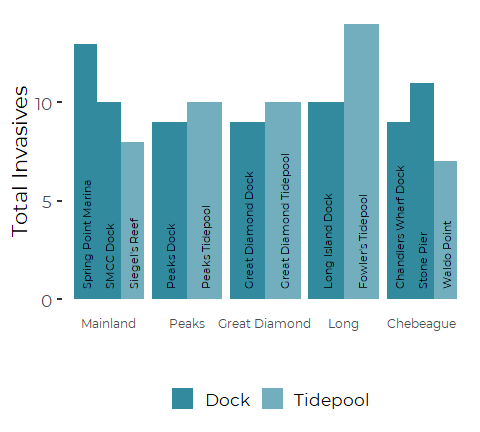
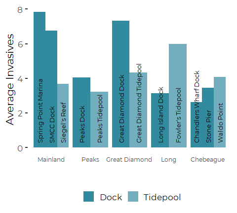
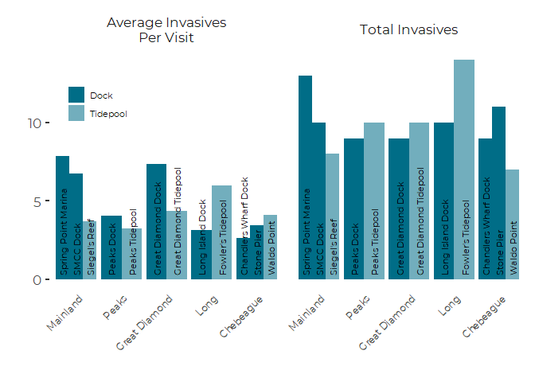
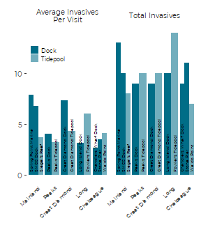
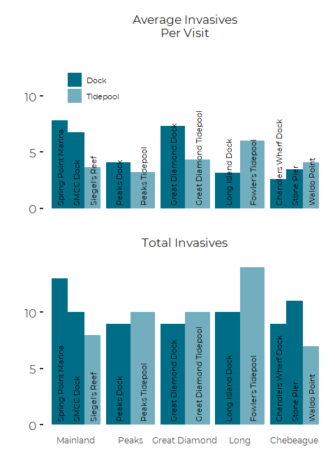
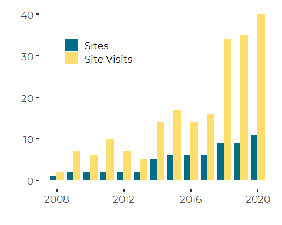
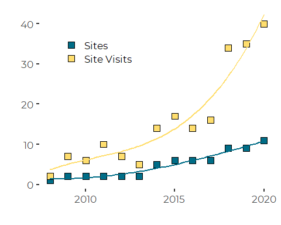
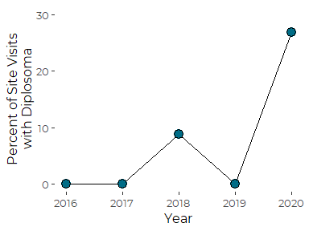
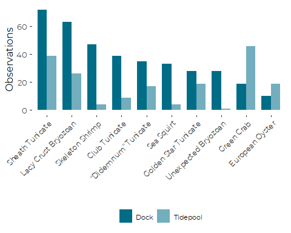

Graphics for MIMIC Invasive Species Data
================
Curtis C. Bohlen, Casco Bay Estuary Partnership
3/16/2021

-   [Introduction](#introduction)
-   [Load Libraries](#load-libraries)
-   [Load Data](#load-data)
    -   [Establish Folder Reference](#establish-folder-reference)
-   [Import Fully QA/QC’d Data](#import-fully-qaqcd-data)
-   [Convert to Factors for Display
    Order](#convert-to-factors-for-display-order)
-   [Add Order Factors](#add-order-factors)
-   [Recent Data Only](#recent-data-only)
-   [Summary Statistics By Site](#summary-statistics-by-site)
    -   [Total Invasive Species
        Observed](#total-invasive-species-observed)
    -   [Average Invasives Observed](#average-invasives-observed)
    -   [Combine](#combine)
    -   [Create Long Version for Facet
        Plot](#create-long-version-for-facet-plot)
    -   [Plots](#plots)
        -   [Total Invasive Species](#total-invasive-species)
    -   [Faceted Plots](#faceted-plots)
        -   [Wide Facet](#wide-facet)
        -   [Tall Facet](#tall-facet)
-   [Sampling Effort](#sampling-effort)
-   [Diplosoma Observations](#diplosoma-observations)
-   [Most Common Species](#most-common-species)


# Introduction

This Notebook provides graphic summaries of data from the MIMIC invasive
species monitoring program from Casco Bay.

The Marine Invader Monitoring and Information Collaborative (MIMIC) in
Casco Bay is a partnership between CBEP, the Wells National Estuarine
Research Reserve (Wells NERR), and the regional MIMIC program. The
Regional effort includes participants from several other New England
States.

Wells NERR trains community scientists to identify (currently) 23
species of invasives, including tunicates, bryozoans, algae and
crustaceans. Scientists visit sites monthly between May and October and
document abundance of these non-native species.

The program began with two sites in Casco Bay in 2008 and has expanded
in ensuing years to sample an additional mainland site and 12 sites
across four Islands (Peaks, Chebeague, Long, and Great Diamond).

# Load Libraries

``` r
library(tidyverse)
#> -- Attaching packages --------------------------------------- tidyverse 1.3.1 --
#> v ggplot2 3.3.5     v purrr   0.3.4
#> v tibble  3.1.6     v dplyr   1.0.7
#> v tidyr   1.1.4     v stringr 1.4.0
#> v readr   2.1.0     v forcats 0.5.1
#> -- Conflicts ------------------------------------------ tidyverse_conflicts() --
#> x dplyr::filter() masks stats::filter()
#> x dplyr::lag()    masks stats::lag()
library(readxl)

library(VGAM)
#> Loading required package: stats4
#> Loading required package: splines
#> 
#> Attaching package: 'VGAM'
#> The following object is masked from 'package:tidyr':
#> 
#>     fill
#library(readr)

#library(GGally)
#library(zoo)
#library(lubridate)  # here, for the make_datetime() function

library(CBEPgraphics)
load_cbep_fonts()
theme_set(theme_cbep())
```

# Load Data

## Establish Folder Reference

``` r
sibfldnm <- 'Data'
parent   <- dirname(getwd())
sibling  <- file.path(parent,sibfldnm)
dir.create(file.path(getwd(), 'figures'), showWarnings = FALSE)
```

# Import Fully QA/QC’d Data

``` r
fn <- 'Abundance_Data.csv'
abundance_data <- read_csv(file.path(sibling, fn),
                           col_types = cols(
                             Date = col_datetime(format = ""),
                             Site = col_character(),
                             Type = col_character(),
                             City = col_character(),
                             Salinity = col_double(),
                             Temp = col_double(),
                             Month = col_character(),
                             Year = col_integer(),
                             Where = col_character(),
                             Species = col_character(),
                             Common = col_character(),
                             Abundance = col_character()
                           )) %>%
  mutate(Type  = factor(Type, levels = c('Dock', 'Tidepool')),
         Month = factor(Month, levels = month.abb),
         Abundance = ordered(Abundance, levels = c('Absent', 'Rare', 'Few', 
                                                   'Common', 'Abundant')))

fn <- 'Presence_Data.csv'
presence_data <- read_csv(file.path(sibling, fn),
                          col_types = cols(
                             Date = col_datetime(format = ""),
                             Site = col_character(),
                             Type = col_character(),
                             City = col_character(),
                             Salinity = col_double(),
                             Temp = col_double(),
                             Month = col_character(),
                             Year = col_integer(),
                             Where = col_character(),
                             Species = col_character(),
                             Common = col_character(),
                             Present = col_logical()
                           )) %>%
  mutate(Type  = factor(Type, levels = c('Dock', 'Tidepool')),
         Month = factor(Month, levels = month.abb))
```

# Convert to Factors for Display Order

``` r
abundance_data <- abundance_data %>%
 mutate(Site = factor(Site, levels = 
                         c(  "Spring Point Marina",
                             "SMCC Dock", 
                             "Siegel's Reef",
                             
                             "Peaks Dock",
                             "Peaks Tidepool",
                             
                             "Great Diamond Island Dock", 
                             "Great Diamond Island Tidepool",
                             
                             "Long Island Dock",
                             "Fowler's Tide Pool",
                             
                             "Chandlers Wharf Dock",
                             #"Chebeague Island Boat Yard",
                             "Chebeague Stone Pier", 
                             "Waldo Point"
                         )),
         Where = factor(Where, levels = c("Mainland", "Peaks","Great Diamond",
                                          "Long", "Chebeague") ))
```

``` r
presence_data <- presence_data %>%
  mutate(Site = factor(Site, levels = 
                         c(  "Spring Point Marina",
                             "SMCC Dock", 
                             "Siegel's Reef",
                             
                             "Peaks Dock",
                             "Peaks Tidepool",
                             
                             "Great Diamond Island Dock", 
                             "Great Diamond Island Tidepool",
                             
                             "Long Island Dock",
                             "Fowler's Tide Pool",
                             
                             "Chandlers Wharf Dock",
                             "Chebeague Stone Pier", 
                             "Waldo Point"
                         )),
         Where = factor(Where, levels = c("Mainland", "Peaks","Great Diamond",
                                          "Long", "Chebeague") ))
```

# Add Order Factors

We need to organize graphics by island in consistent structure. We will
use a bar chart, organized by Island and a common sequence within island
groups. To facilitate that, we need a factor that orders sites
consistently within island groups. While we are at it, we create
alternate labels for the plots.

``` r
orders <- tribble (
  ~Site,                            ~Order,      ~Label,
  "Spring Point Marina",               1,         "Spring Point Marina",  
  "SMCC Dock",                         2,         "SMCC Dock",
  "Siegel's Reef",                     3,         "Siegel's Reef",  
  
  "Peaks Dock",                        1,          "Peaks Dock",          
  "Peaks Tidepool",                    2,          "Peaks Tidepool", 
  
  "Great Diamond Island Dock",         1,          "Great Diamond Dock",    
  "Great Diamond Island Tidepool",     2,          "Great Diamond Tidepool",
  
  "Long Island Dock",                  1,          "Long Island Dock",  
  "Fowler's Tide Pool",                2,          "Fowler's Tidepool",   
  
  "Chandlers Wharf Dock",              1,          "Chandlers Wharf Dock",  
  "Chebeague Stone Pier",              2,          "Stone Pier",   
  "Waldo Point" ,                      3,          "Waldo Point")
```

``` r
abundance_data <- abundance_data %>%
  left_join(orders, by = 'Site')

presence_data <- presence_data %>%
  left_join(orders, by = 'Site')
```

# Recent Data Only

``` r
recent_data <- presence_data %>% 
  filter(Year > 2015)
```

# Summary Statistics By Site

## Total Invasive Species Observed

``` r
total_spp <- recent_data %>%
  group_by(Site, Where, Type, Order, Label, Species) %>%
  summarize(Spotted = any(Present),
            .groups = 'drop_last') %>%
  group_by(Site, Where, Type, Order, Label) %>%
  summarize(Tot_Species = sum(Spotted),
            .groups = 'drop')
total_spp
#> # A tibble: 12 x 6
#>    Site                          Where         Type     Order Label  Tot_Species
#>    <chr>                         <fct>         <fct>    <dbl> <chr>        <int>
#>  1 Chandlers Wharf Dock          Chebeague     Dock         1 Chand~           9
#>  2 Chebeague Stone Pier          Chebeague     Dock         2 Stone~          11
#>  3 Fowler's Tide Pool            Long          Tidepool     2 Fowle~          14
#>  4 Great Diamond Island Dock     Great Diamond Dock         1 Great~           9
#>  5 Great Diamond Island Tidepool Great Diamond Tidepool     2 Great~          10
#>  6 Long Island Dock              Long          Dock         1 Long ~          10
#>  7 Peaks Dock                    Peaks         Dock         1 Peaks~           9
#>  8 Peaks Tidepool                Peaks         Tidepool     2 Peaks~          10
#>  9 Siegel's Reef                 Mainland      Tidepool     3 Siege~           8
#> 10 SMCC Dock                     Mainland      Dock         2 SMCC ~          10
#> 11 Spring Point Marina           Mainland      Dock         1 Sprin~          13
#> 12 Waldo Point                   Chebeague     Tidepool     3 Waldo~           7
```

## Average Invasives Observed

``` r
avg_spp <- recent_data %>%
  group_by(Site, Date) %>%
  summarize(spp_present = sum(Present),
            .groups = 'drop') %>%
  group_by(Site) %>%
  summarize(Avg_Species = mean(spp_present),
            .groups = 'drop')
avg_spp
#> # A tibble: 12 x 2
#>    Site                          Avg_Species
#>    <chr>                               <dbl>
#>  1 Chandlers Wharf Dock                 2.62
#>  2 Chebeague Stone Pier                 3.45
#>  3 Fowler's Tide Pool                   6   
#>  4 Great Diamond Island Dock            7.33
#>  5 Great Diamond Island Tidepool        4.33
#>  6 Long Island Dock                     3.12
#>  7 Peaks Dock                           4.06
#>  8 Peaks Tidepool                       3.22
#>  9 Siegel's Reef                        3.67
#> 10 SMCC Dock                            6.75
#> 11 Spring Point Marina                  7.85
#> 12 Waldo Point                          4.09
```

## Combine

``` r
total_spp <- total_spp %>%
  left_join(avg_spp, by = 'Site')
```

## Create Long Version for Facet Plot

``` r
total_spp_long <- total_spp %>%
  pivot_longer(c(Tot_Species, Avg_Species),
               names_to = 'Parameter', 
               values_to = 'Value')
```

## Plots

### Total Invasive Species

``` r
ggplot(total_spp, aes(x = Where, y = Tot_Species, group = Order, fill = Type)) +
  geom_col(position = 'dodge') +
  
  geom_text(aes(label = Label, y = 0.51), 
            position = position_dodge(0.9),
            angle = 90, 
            hjust = 0,
            size = 3) +
  
  ylab('Total Invasives') +
  xlab('') +
  
  scale_fill_manual(values = cbep_colors2()[3:6], name = '') +

  
  theme(axis.text.x = element_text( #angle = 45, 
                                   size = 9, 
                                   #hjust = 1
                                   ),
        legend.position = 'bottom',
        axis.ticks.length.x = unit(0, 'cm'))
```



``` r
ggsave('figures/total_invasives_by_site.pdf', device = cairo_pdf, 
       width = 4.5, height = 5)
```

#### Average Invasives Species Observed Per Visit

``` r
ggplot(total_spp, aes(x = Where, y = Avg_Species, group = Order, fill = Type)) +
  geom_col(position = 'dodge') +
  
  geom_text(aes(label = Label, y = 0.25), 
            position = position_dodge(0.9),
            angle = 90, 
            hjust = 0,
            size = 3.5) +
  
  ylab('Average Invasives') +
  xlab('') +
  
  scale_fill_manual(values = cbep_colors2()[3:6], name = '') +

   theme(axis.text.x = element_text( #angle = 45, 
                                   size = 9, 
                                   #hjust = 1
                                   ),
        legend.position = 'bottom',
        axis.ticks.length.x = unit(0, 'cm'))
```



``` r
ggsave('figures/laverage_invasives_by_site.pdf', device = cairo_pdf, 
       width = 4.5, height = 5)
```

## Faceted Plots

#### Create Facet Labels

``` r
mylabs <- c('Total Invasives', 'Average Invasives\nPer Visit')
names(mylabs) = c('Tot_Species', 'Avg_Species')

mylabs
#>                    Tot_Species                    Avg_Species 
#>              "Total Invasives" "Average Invasives\nPer Visit"
```

### Wide Facet

``` r
ggplot(total_spp_long, aes(x = Where, y = Value, group = Order, fill = Type)) +
  geom_col(position = 'dodge') +
  
  geom_text(aes(label = Label, y = 0.25), 
            position = position_dodge(0.9),
            angle = 90, 
            hjust = 0,
            size = 3) +
  
  facet_wrap(~Parameter, labeller = labeller(Parameter = mylabs),  scales = 'fixed') +
  
  ylab('') +
  xlab('') +
  
  scale_fill_manual(values = cbep_colors2()[c(2,4)], name = '') +
  guides(fill = guide_legend(override.aes = list(size = 0.75))) +
  
  theme(axis.text.x = element_text(angle = 45, 
                                   size = 9, 
                                   hjust = 1
                                   ),
        legend.position = c(0.1, 0.8),
        legend.title = element_text(size = 8), 
        legend.text = element_text(size = 8),
        axis.ticks.length.x = unit(0, 'cm'))
```



``` r
ggsave('figures/wide_facet_invasives_by_site.pdf', device = cairo_pdf, 
       width = 7, height = 5)
```

#### Wide Facet, Rescaled

We rescaled this to fit more closely with the final page layout.

``` r
ggplot(total_spp_long, aes(x = Where, y = Value, group = Order, fill = Type)) +
  geom_col(position = 'dodge') +
  
  geom_text(aes(label = Label, y = 0.25), 
            position = position_dodge(0.9),
            angle = 90, 
            hjust = 0,
            vjust = 0.25,
            size = 1.5) +
  
  facet_wrap(~Parameter, labeller = labeller(Parameter = mylabs),  scales = 'fixed') +
  
  ylab('') +
  xlab('') +
  
  scale_fill_manual(values = cbep_colors2()[c(2,4)], name = '') +
  
  guides(fill = guide_legend(override.aes = list(size = 0.25))) +
  
  theme_cbep(base_size = 9) +
  theme(axis.text.x = element_text(angle = 45, 
                                   size = 6, 
                                   hjust = 1
                                   ),
        legend.position = c(0.125, 0.85),
        legend.title = element_text(size = 6), 
        legend.text = element_text(size = 6),
        legend.key.size = unit(.125, "in"),
        axis.ticks.length.x = unit(0, 'cm'))
```



``` r
ggsave('figures/wide_facet_invasives_by_site_revised.pdf', device = cairo_pdf, 
       width = 3, height = 3.5)
```

### Tall Facet

``` r
ggplot(total_spp_long, aes(x = Where, y = Value, group = Order, fill = Type)) +
  geom_col(position = 'dodge') +
  
  geom_text(aes(label = Label, y = 0.25), 
            position = position_dodge(0.9),
            angle = 90, 
            hjust = 0,
            size = 3) +
  
  facet_wrap(~Parameter, nrow = 2,
             labeller = labeller(Parameter = mylabs),  scales = 'fixed') +
  
  ylab('') +
  xlab('') +
  
  scale_fill_manual(values = cbep_colors2()[c(2,4)], name = '') +
  guides(fill = guide_legend(override.aes = list(size = 0.75))) +
  
  theme_cbep(base_size = 16) +
  theme(axis.text.x = element_text(#angle = 45, 
                                   size = 9, 
                                   #hjust = 1
                                   ),
        legend.position = c(0.175, 0.9),
        legend.title = element_text(size = 8), 
        legend.text = element_text(size = 8),
        axis.ticks.length.x = unit(0, 'cm'))
```



``` r
ggsave('figures/long_facet_invasives_by_site.pdf', device = cairo_pdf, 
       width = 5, height = 7)
```

# Sampling Effort

``` r
effort <- presence_data %>%
  group_by(Year, Site, Date) %>%
  summarize(Observations = any(Present),
            .groups = 'drop_last') %>%
  summarize(Observations = sum(Observations),
            .groups = 'drop_last') %>%
  summarize(Sites = sum(Observations > 0),
            `Site Visits` = sum(Observations),
            .groups = 'drop_last')
effort
#> # A tibble: 13 x 3
#>     Year Sites `Site Visits`
#>    <int> <int>         <int>
#>  1  2008     1             2
#>  2  2009     2             7
#>  3  2010     2             6
#>  4  2011     2            10
#>  5  2012     2             7
#>  6  2013     2             5
#>  7  2014     5            14
#>  8  2015     6            17
#>  9  2016     6            14
#> 10  2017     6            16
#> 11  2018     9            34
#> 12  2019     9            35
#> 13  2020    11            40
```

``` r
effort %>%
  pivot_longer(c(Sites,`Site Visits`),
               names_to = 'Parameter',
               values_to = 'Values')  %>%
  mutate(Parameter = factor(Parameter, levels = c('Sites', 'Site Visits'))) %>%
  
  ggplot(aes(x = Year, y = Values, fill = Parameter)) +
  geom_col(position = position_dodge(0.75)) +
  
  scale_fill_manual(values = cbep_colors(), name = '') +
  
  ylab('') +
  xlab('') +
 #ggtitle('Increaseing Effort') +
   
  theme(legend.position = c(0.25, 0.8))
```



``` r
  
  ggsave('figures/sampling_effort_bars.pdf', device = cairo_pdf, 
       width = 5, height = 7)
```

``` r
effort %>%
  pivot_longer(c(Sites, `Site Visits`),
               names_to = 'Parameter',
               values_to = 'Values')  %>%
  mutate(Parameter = factor(Parameter, levels = c('Sites', 'Site Visits'))) %>%
  
  ggplot(aes(x = Year, y = Values, fill = Parameter)) +
  geom_point(shape = 22, size = 4) +
  geom_smooth(aes(color = Parameter),
              se = FALSE, method = 'lm', formula= y ~ poly(x, 3),
              lty = 1,
              show.legend = FALSE) +
  
  scale_fill_manual(values = cbep_colors(), name = '') +
  scale_color_manual(values = cbep_colors(), name = '') +
  scale_x_continuous(breaks= c(2010, 2015,2020)) +
  
  ylab('') +
  xlab('') +
   
  theme(legend.position = c(0.25, 0.8))
```



``` r
  ggsave('figures/sampling_effort_dots.pdf', device = cairo_pdf, 
       width = 5, height = 7)
```

# Diplosoma Observations

``` r
diplosoma <- recent_data %>%
  filter(Species == 'Diplosoma listerianum' ) %>%
  group_by(Year) %>%
  summarize(observations = sum(Present),
            records = n(),
            percent = 100 * observations / records)
```

``` r
ggplot(diplosoma, aes(x = Year, y = percent)) +
  geom_line() +
  geom_point(shape = 21, size = 4, fill = cbep_colors()[1]) +

  
  ylab('Percent of Site Visits\nwith Diplosoma') +
  scale_y_continuous(breaks = c(0,10,20,30), limits = c(0,30)) +

  theme_cbep(base_size = 12)
```



``` r
  ggsave('figures/diplosoma.pdf', device = cairo_pdf, 
       width = 3, height = 4)
```

# Most Common Species

Our goal here is to look at the ten most abundant invasive species,
ordered by their abundance on docks over the past 5 years. That takes a
little coding to arrange

``` r
common <- recent_data %>%
  # First, create data by species and by Tidepool versus Dock.
  filter(! is.na(Species)) %>%
  group_by(Species, Common, Type) %>%
  summarize(Observations = sum(Present),
            .groups = 'drop') %>%
  
  # Now we need to create a value that indicates how many times the species was 
  # Observed and how many times it was observed on docks. 
  # The `Dock` value is used to order data in the graphics.
  group_by(Species) %>%
  mutate(Total = sum(Observations),
         Dock =  sum(if_else(Type == "Dock",
                             Observations,
                             as.integer(0)))) %>%
  ungroup() %>%
  
  # Slice the data to the top ten species.
  arrange(- Total) %>%
  slice_head(n = 20) %>%
  select(-Total) %>%
  
  # And convert the common names to a factor, ordered by frequency on Docks
  mutate(Common = if_else(Species == 'Didemnum vexillum', 
                          '"Didemnum" Tunicate',
                          Common),
         Common = factor(Common),
         Common = fct_reorder(Common, -Dock))%>%
  select(-Dock)
```

``` r
levels(common$Common)
#>  [1] "Sheath Tunicate"       "Lacy Crust Bryozoan"   "Skeleton Shrimp"      
#>  [4] "Club Tunicate"         "\"Didemnum\" Tunicate" "Sea Squirt"           
#>  [7] "Golden Star Tunicate"  "Unexpected Bryozoan"   "Green Crab"           
#> [10] "European Oyster"
```

``` r
common %>%
  ggplot(aes(x = Common, y = Observations, fill = Type)) +
  geom_col(width = 0.75, position = 'dodge') +
  
  scale_fill_manual(values = cbep_colors2()[c(2,4)], name = '') +
  xlab('') +
  
  theme_cbep(base_size = 12) +
  theme(axis.text.x = element_text(angle = 45,
                                   hjust = 1,
                                   size = 9),
        legend.position = 'bottom',
        legend.title = element_text(size = 8), 
        legend.text = element_text(size = 8))
```



``` r
ggsave('figures/common_invasives.pdf', device = cairo_pdf, 
       width = 5, height =4)
```
